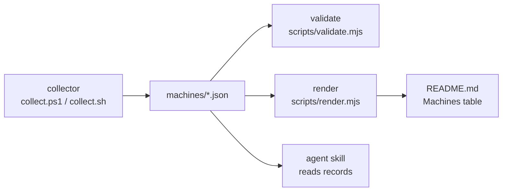

# Architecture

The repository records each fleet machine as classes, counts, and buckets. A
collector reads the local machine and writes one record to `machines/`. The
validator checks every record against the schema and the non-identifying rules.
The renderer turns the records into the README table. An agent skill reads the
same records to answer questions about the fleet.

## Flow

1. `scripts/collect.ps1` on Windows or `scripts/collect.sh` on Linux and WSL
   detects the hardware classes and writes `machines/<id>.json`.
2. `scripts/validate.mjs` checks every record against the schema and the
   non-identifying rules, and fails on any problem.
3. `scripts/render.mjs` writes the table between the `machines:start` and
   `machines:end` markers in the README. `--check` fails when the table is
   stale.
4. `scripts/test.mjs` runs the validation, the render check, and the fixtures.
